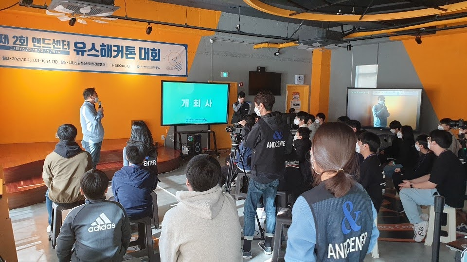

# 😷 MATRiX  
*Mask Authentication and Tracking Recognition eXpert*

> 🎓 **첫 메이킹 프로젝트** : 코로나19 시절, 감염 예방을 위하여 사람들이 마스크 착용 유무를 인식하여 경고를 주는 시스템

  

## 🎞 Product Image
🔗 [Click here](https://github.com/hexagon-bh/MATRiX/blob/main/product.jpg)

## ⚡ Team
**파이리** 💫

## 🛠️ Maker
김강현, 이재준, 우수연

## 📅 Production Period
⏳ 2021.11 ~ 2021.12

## 📂 Engineering Files
📁 None

---
### 😷 MATRiX Introducing
**코로나19 시절, 코로나19 시절, 감염 예방을 위하여 사람들이 마스크 착용 유무를 teachable machine을 통하여 인식하고 마스크를 착용하지 않았다면 Arduino의 LED와 소리 모듈을 통하여 알림을 주는 시스템

### 🎫 Naming Introducing
<strong>Mask Authentication and Tracking Recognition eXpert</strong>
>"마스크 인증(Mask Authentication)"과 "추적 및 인식(Tracking Recognition)"을 결합하여, 마스크 착용 유무를 정확히 추적하고 판별하는 시스템을 의미합니다. 약칭인 MATRiX는 마치 인공지능 관련 기술을 상징하는 느낌도 주고, 직관적으로 기억하기 좋습니다.

### 🔋 Circuit Diagram
🔗 [Click here](https://github.com/hexagon-bh/MATRiX/blob/main/%ED%9A%8C%EB%A1%9C%EB%8F%84.jpg)

### 🏆 프로젝트 성과
- ✅ **첫 메이킹 프로젝트** 🎓
- ✅ **아두이노와 프로그래밍 기초** 💡
- ✅ **사회에 도움이 되는 작품에 관심을 가지게 된 계기** 🎯

### 🌍 향후 발전 방향
이 시스템을 공공장소, 학교, 병원 등 스마트 환경에 통합하여, 마스크 착용 여부를 실시간으로 모니터링하고 경고 시스템을 자동으로 작동시킬 수 있습니다. 예를 들어, 건물 출입 시 자동으로 마스크 착용 여부를 인식하고 경고를 주는 시스템을 구축할 수 있습니다.

💬 **문의 및 협업 제안은 언제든지 환영합니다!** 😊

  
